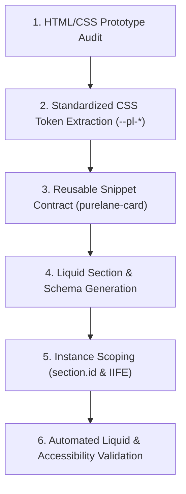

# Purelane AI Workflow & Delegation Notes

This document analyzes the AI-assisted engineering process used to convert the `purelane-homepage.html` prototype into 5 production-ready Shopify Dawn sections. It details what was delegated to the AI agent, where human intervention was required, and how to scale this workflow to 20+ section conversions.

---

## 1. Division of Labor: AI Delegation vs. Human Oversight

| Workflow Task | Handled By | Rationale & Execution Notes |
|---|---|---|
| **Code Generation & Liquid Markup** | **AI Agent** | AI generated clean, semantic Liquid templates for all 5 sections, shared CSS tokens, IIFE JS modules, and schema definitions. |
| **CSS Refactoring & Scope Isolation** | **AI Agent** | AI extracted the V2 light palette from dual `:root` declarations, prefixed custom properties with `--pl-` to prevent Dawn collisions, and scoped layout variables. |
| **Architectural Tradeoff Decisions (Q1–Q3)** | **Human + AI Pair** | Human approved technical tradeoffs: using Metafields for per-product reviews (Q1), block settings for combo badges (Q2), and section URL settings for bundle CTAs (Q3). |
| **Schema & Merchant Utility Audit** | **Human Oversight** | Human verified that every heading, image, price, link, and repeatable block in the schema mapped to genuine merchant requirements. |
| **Edge-Case Defensive Logic** | **AI Agent** | AI implemented fallback behavior for sold-out products (`product.available`), missing images (gradient placeholder), and long titles (2-line CSS clamping). |

---

## 2. Friction Points & Course Corrections During Build

### Issue 1: Dual Palette Collision in Prototype
- **Challenge**: The prototype contained both V1 (dark teal) and V2 (light mint) `:root` styles stacked sequentially. Blindly converting the CSS would have resulted in conflicting color variables.
- **Correction**: Guided the agent to systematically extract only the active V2 light palette variables, rename them with `--pl-` prefixes, and discard the inactive V1 block.

### Issue 2: Hardcoded Global IDs in Prototype JavaScript
- **Challenge**: Prototype scripts used `document.getElementById('hstage')` and `#heroProd`. If a merchant adds two Hero sections in the Shopify Theme Editor, global ID selectors break or manipulate the wrong section instance.
- **Correction**: Enforced strict ID scoping across all section Liquid files and JavaScript scripts using `{{ section.id }}` (e.g. `id="pl-hstage-{{ section.id }}"`).

### Issue 3: Bundle Pricing Sourcing without App Dependencies
- **Challenge**: Shopify native pricing is tied to single product objects. Combo and bundle tiers (e.g., "Any 3 for ₹499") represent multi-product discounted rates that do not natively exist on individual products.
- **Correction**: Opted for defensible block settings for bundle pricing over hardcoding in Liquid or forcing an external third-party bundle app dependency.

---

## 3. Systematization Playbook: Scaling to 20+ Section Conversions

To scale this process across 20+ client sites or theme conversion projects, the following systematic workflow should be implemented:

### Automation Guidelines for Scaled Execution:

1. **Establish a Strict Component Contract First**:
   - Always build the shared parameterized card component (`snippets/card-component.liquid`) before building grid sections. Ensure it accepts a standardized object signature (`product`, `custom_image`, `price_override`, `badge_override`).

2. **Automated Schema Boilerplate Generation**:
   - Standardize Liquid schema structures using pre-defined JSON schema templates for Hero, Grid, Slider, and Marquee layouts. This guarantees consistent setting IDs (`heading`, `subheading`, `cta_label`, `cta_url`) across all theme sections.

3. **Strict CSS Prefix Rules**:
   - Enforce prefix rules (e.g., `--theme-*` or `--pl-*`) on all custom properties during extraction to prevent regressions when dropping sections into foreign themes like Dawn, Impulse, or Prestige.

4. **Automated Verification Suite**:
   - Use automated Liquid linters (e.g., Theme Check) and automated accessibility checkers (axe-core) to verify valid Liquid schema syntax, alt text compliance, and proper `:focus-visible` states prior to deployment.
